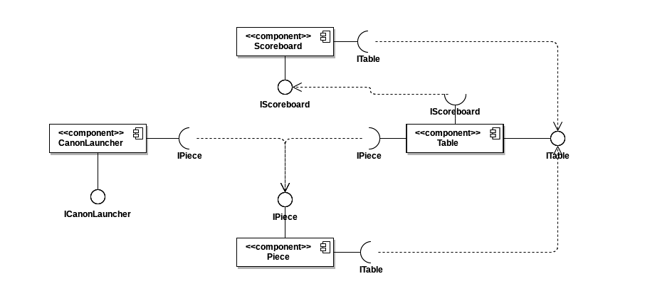
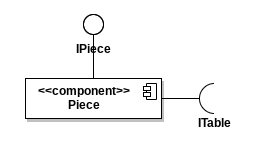

# Projeto Trabalho

# Equipe
* Melanie N Soares RA: 241997

# Descrição Resumido do Projeto
* Criação de um jogo de niveis utilizando conceitos de programação orientado a objetos e 'cellular automata' para um trabalho de Unicamp

# Diagrama Geral de Componentes

# Componente Table

## Interfaces
  * Interfaces associados a esse componente:
  

  
Campo | Valor
----- | -----
Classe | component.Table
Autores | Melanie N Soares
Objetivo | Tratar os dados do tabuleiro
Interface | ITable

## Detalhamento das Interfaces

### Interface ITable

Método | Objetivo
-------| --------
setTable | Inicializar um tabuleiro pre feito de acordo com o nível atual do jogador
updateTable | Encurtar o número de linhas do tabuleiro ao fazer jogadas
checkNeighbors| Verificar a vizinhaca da peça lançada afim de determinar o novo estado do tabuleiro
deletePieces| Remover peças do tabuleiro
showTable| Imprimir o tabuleiro na tela

~~~
public interface ITable {

 public void setTable(int level);
 public void updateTable();
 public void checkNeighbors();
 public void deletePieces();
 public void showTable();
 
}
~~~

# Componente Scoreboard

## Interfaces
  * Interfaces associados a esse componente:
  

  
Campo | Valor
----- | -----
Classe | components.Scoreboard
Autores | Melanie N Soares
Objetivo | Armazena e trata dados do jogo e jogador 
Interface | IScoreboard

## Detalhamento das Interfaces
### Interface IScoreBoard

Método | Objetivo
-------| --------
updatePoints | Atualizar os pontos do jogador
updateLevel | Atualizar o nível atual do jogador
updateCount| Atualizar o número de peças no tabuleiro
getPoints | Retornar os pontos do jogador
getLevel | Retornar o nível do jogador
getCount | Retornar o numero de peças

~~~
public interface IScoreboard {
 
 public void updatePoints(int points);
 public void updateLevel(int level);
 public void updateCount(int count);
 public int getPoints();
 public int getLevel();
 public int getCount();
 
}
~~~

# Componente Piece

## Interfaces
  * Interfaces associados a esse componente:
  

  
Campo | Valor
----- | -----
Classe | components.Piece
Autores | Melanie N Soares
Objetivo | Tratar as peças presentes no jogo
Interface | IPiece

## Detalhamento das Interfaces

### Interface IPiece

Método | Objetivo
-------| --------
calculateMovement| Calcular o local no tabuleiro que uma peça lançada cairá

~~~
public interface IPiece {
 public int[] calculateMovement(Table table);
 }
~~~

# Componente CanonLauncher

## Interfaces
  * Interfaces associados a esse componente:
  

  
Campo | Valor
----- | -----
Classe | components.CanonLauncher
Autores | Melanie N Soares
Objetivo | Simular e armazenar peças de um canhão
Interface | ICanonLauncher

## Detalhamento das Interfaces

### Interface ICanonLauncher

Método | Objetivo
-------| --------
setCanon | Inicializar um vetor queue que armazena as peças a serem lançadas
getPiece | Retornar uma peça
updateCanon| Atualizar o vetor queue

~~~
public interface ICanonLauncher {

 public void setCanon();
 public Piece getPiece();
 public void updateCanon();
 
}

~~~

